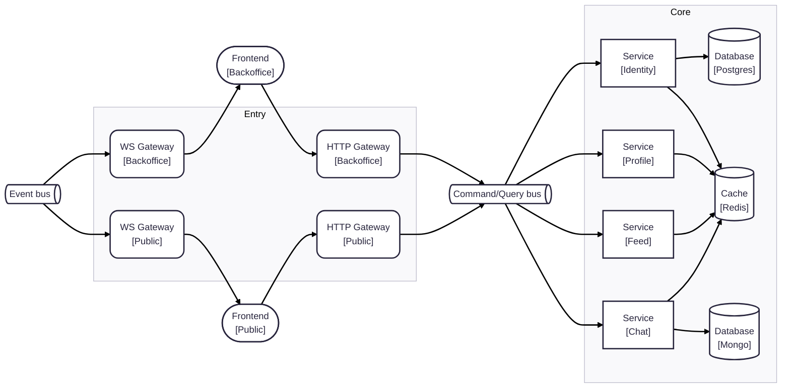

# Skill Showcase – Instagram‑Style Social Platform


A full‑stack, microservice‑oriented clone of Instagram that demonstrates modern engineering skills and tooling. The project delivers a minimal yet complete social‑media experience – feeds, stories, chat, subscriptions, search and recommendations – while showcasing production‑grade patterns such as event‑driven architecture, CQRS, polyglot persistence and a monorepo workflow.

---

## ✨ Key Functionalities

| Domain            | Features                                                        |
| ----------------- | --------------------------------------------------------------- |
| **Social Feed**   | Infinite scroll, image/video posts, like & comment interactions |
| **Profiles**      | Editable bio, avatar, grid/list views, follower counts          |
| **Subscriptions** | Follow / unfollow, private vs. public accounts, notifications   |
| **Chat**          | Real‑time 1‑to‑1 and group messaging, typing indicators         |
| **Discovery**     | Search by username / hashtags, algorithmic recommendations      |
| **Notifications** | Cross‑service push for likes, follows, comments & messages      |

---

## 🏗️ Tech Stack

| Layer              | Technology                                                                                                                       | Purpose                                     |
| ------------------ | -------------------------------------------------------------------------------------------------------------------------------- | ------------------------------------------- |
| **API & Services** | **NestJS** microservices                                                                                                         | Business logic, validation, CQRS            |
| **Event Backbone** | **NATS JetStream**                                                                                                               | Reliable async messaging, sagas             |
| **Datastores**     | **PostgreSQL** – relational core <br> **MongoDB** – document / feed timelines <br> **Redis** – caching, pub/sub, session storage | Polyglot persistence optimized per workload |
| **Frontend**       | **React 18** + **Astro**                                                                                                         | Island‑architecture SPA with partial SSR    |
| **Dev Workflow**   | **pnpm workspaces** / **Nx** monorepo                                                                                            | Unified scripts, generators, linting        |
| **Infra**          | Docker Compose / K8s Helm charts                                                                                                 | Local dev & cloud‑native deploy             |

---

## 🖼️ High‑Level Architecture



*Gateway exposes BFF endpoints; each bounded‑context service handles its own database and publishes domain events.*

---

## 📁 Repository Structure (Monorepo)

```
root/
├─ apps/
│  ├─ gateway.public-http/        # HTTP entry points
│  ├─ gateway.public-ws/          # WS entry point for user application
│  ├─ service.identity/           # manages identity-related data
│  ├─ web.public/                 # public react js app
│  └─ ...
├─ packages/
│  ├─ config.eslint/              # holds different eslint configs and rulesets
│  ├─ config.typescript/          # holds basic tsconfig settings
│  ├─ module.authn/               # authentication module
│  ├─ schema.identity-postgres/   # database schema for the identity core + worker service group
│  ├─ schema.profile-postgres/    # database schema for the profile service group
│  └─ ...
├─ docker/
└─ scripts/
```

---

## 🚀 Getting Started (Local Dev)

```bash
# 1. Clone & install deps
pnpm install

# 2. Spin up infrastructure
pnpm run docker:start

# 3. Start all services & frontend
pnpm run dev
```

Navigate to `http://localhost:8080` for the React UI.

---

## 🧩 Core Design Highlights

1. **Event‑Driven Saga Workflows** – cross‑service transactions with JetStream.
2. **CQRS + Outbox** – write models in Postgres, read models in Mongo for timelines.
3. **Idempotent Handlers & DLQs** – resiliency to message replay.
4. **Gateway BFF Pattern** – single entry‑point optimised per‑device.
5. **Modular Monorepo** – shared tooling yet independent deploy artefacts.

---

## 📝 License

Released under MIT License — see `LICENSE` file for details.
